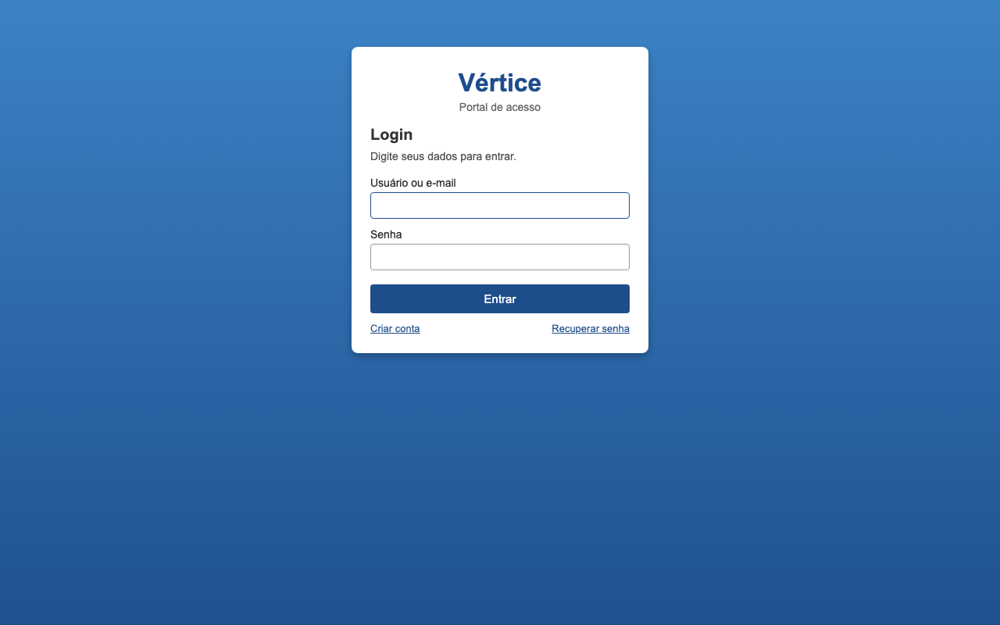
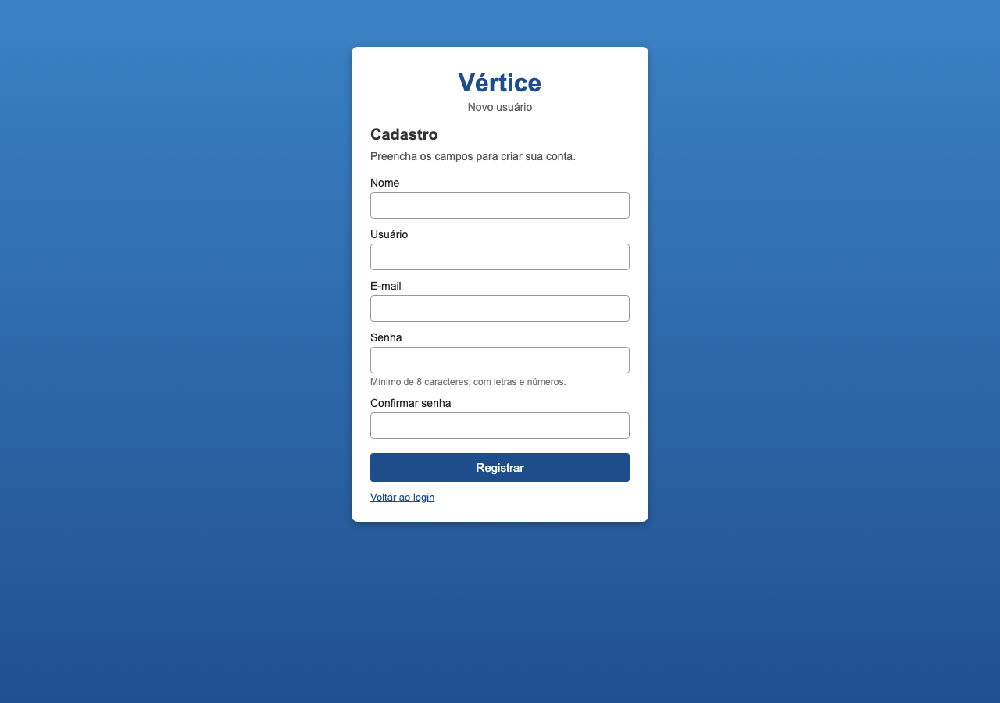
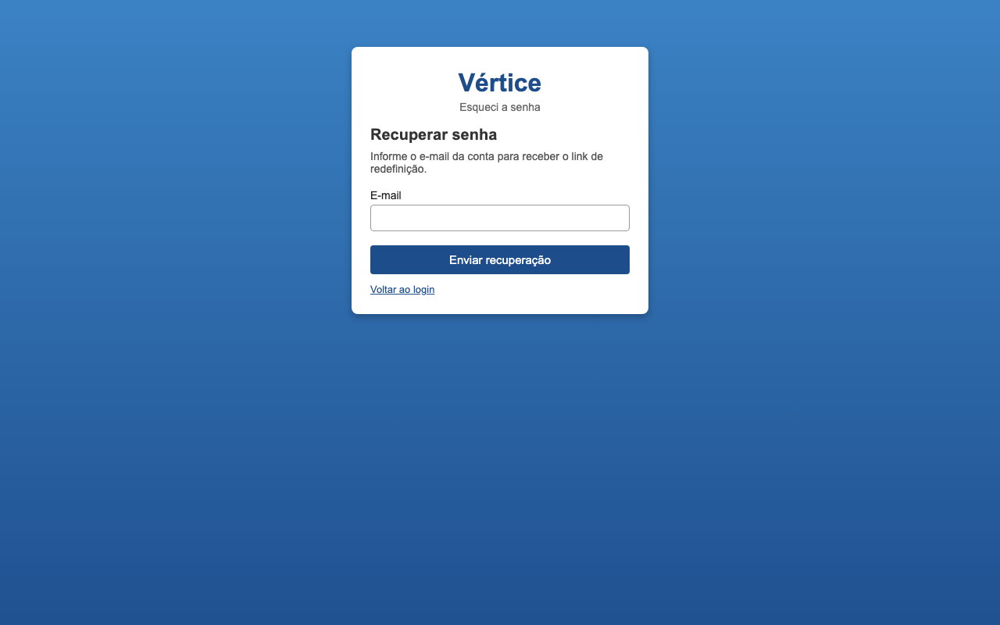

# Vértice

Portal de autenticação e cadastro desenvolvido em **Spring Boot + Thymeleaf** para a disciplina de Desenvolvimento e Integração de Aplicações Web (DIAW), Atividade 02.

A aplicação implementa login, registro de usuários, proteção de rotas e recuperação de senha. As senhas são armazenadas com **BCrypt**. O envio de e-mail na recuperação é opcional e configurável por variáveis de ambiente.

---

## Integrantes

- Pedro Aguiar

---

## Tecnologias utilizadas

- Java 25
- Spring Boot 4.1.1
- Spring Security
- Thymeleaf
- Bean Validation
- Spring Mail (opcional, recuperação de senha)

---

## Estrutura do projeto

```
vertice/
├── pom.xml
├── README.md
└── src/main/
    ├── java/com/example/vertice/
    │   ├── VerticeApplication.java
    │   ├── config/
    │   ├── controller/
    │   ├── dto/
    │   ├── model/
    │   ├── repository/
    │   └── service/
    └── resources/
        ├── application.properties
        ├── static/css/
        └── templates/
            ├── login.html
            ├── register.html
            ├── recoverpassword.html
            ├── reset-password.html
            ├── home.html
            └── admin.html
```

Os usuários cadastrados ficam em memória enquanto a aplicação está no ar. Ao reiniciar o servidor, permanecem apenas as contas iniciais.

---

## Interface


| Login                            | Registro                               |
| -------------------------------- | -------------------------------------- |
|  |  |




---

## Contas de demonstração


| Perfil        | Usuário | E-mail                | Senha       |
| ------------- | ------- | --------------------- | ----------- |
| Administrador | `admin` | `admin@vertice.local` | `Admin1234` |
| Usuário       | `aluno` | `aluno@vertice.local` | `Aluno1234` |


O login aceita **usuário ou e-mail**.

Regras de senha no cadastro e na redefinição: pelo menos **8 caracteres**, com **letras e números**.

---

## Endpoints disponíveis


| Método | Endpoint           | Descrição                      | Acesso  |
| ------ | ------------------ | ------------------------------ | ------- |
| `GET`  | `/login`           | Tela de login                  | público |
| `POST` | `/login`           | Autenticação (Spring Security) | público |
| `GET`  | `/register`        | Tela de cadastro               | público |
| `POST` | `/register`        | Processa o cadastro            | público |
| `GET`  | `/recoverpassword` | Tela de recuperação de senha   | público |
| `POST` | `/recoverpassword` | Gera o pedido de recuperação   | público |
| `GET`  | `/reset-password`  | Tela para definir a nova senha | público |
| `POST` | `/reset-password`  | Salva a nova senha             | público |
| `GET`  | `/home`            | Área autenticada               | logado  |
| `GET`  | `/admin`           | Área administrativa            | `ADMIN` |
| `POST` | `/logout`          | Encerra a sessão               | logado  |


Acessos sem autenticação às áreas protegidas são redirecionados para `/login`. Credenciais inválidas permanecem em `/login?error`.

---

## Configuração

Arquivo: `src/main/resources/application.properties`.

O e-mail **não é obrigatório** para a aplicação subir. Por padrão, `app.mail.enabled=false`. Nesse modo, a recuperação de senha gera um link de redefinição na própria tela, para teste local.

Para enviar o e-mail de verdade (Gmail + senha de app):

```bash
export MAIL_ENABLED=true
export MAIL_USERNAME=seu-email@gmail.com
export MAIL_PASSWORD=sua-senha-de-app
```

Não publique senhas, tokens ou senhas de app no GitHub. Use variáveis de ambiente.

Referência da disciplina para o envio de e-mail: [SendEmail](https://github.com/joaopauloaramuni/desenvolvimento-e-integracao-de-aplicacoes-web/tree/main/PROJETOS/SpringBoot/SendEmail).

---

## Como executar localmente


### 1. Clonar o repositório

```
git clone https://github.com/pedro-aguiarsv/diaw-github.git
```


### 2. Entrar na pasta do projeto

```
cd atividade02/vertice
```


### 3. Compilar o projeto

```
./mvnw clean install
```


### 4. Executar a aplicação

```
./mvnw spring-boot:run
```


### 5. Abrir no navegador

```
http://localhost:8080/login
```

---

## Fluxo de recuperação de senha

1. Acesse `/recoverpassword` e informe um e-mail cadastrado, por exemplo `aluno@vertice.local`.
2. Sem SMTP configurado, a página mostra o link de redefinição.
3. Com SMTP configurado, o link chega por e-mail.
4. Em `/reset-password`, defina a nova senha e volte ao login.

---

## Licença

Projeto acadêmico, desenvolvido para fins educacionais na disciplina de DIAW.