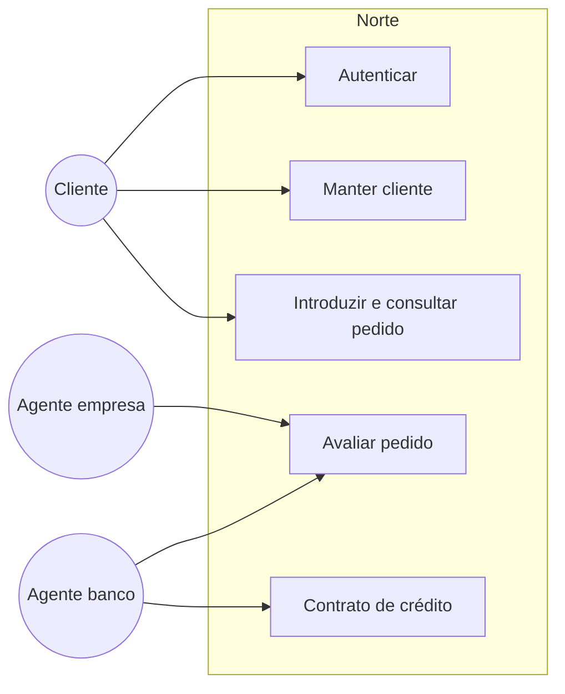
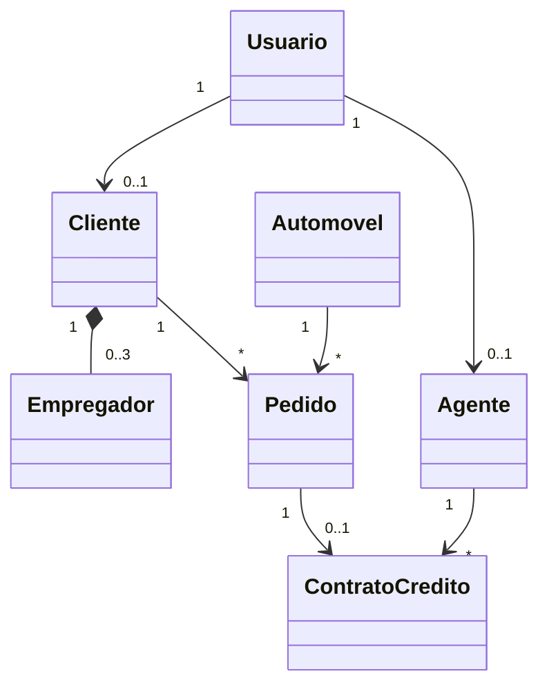
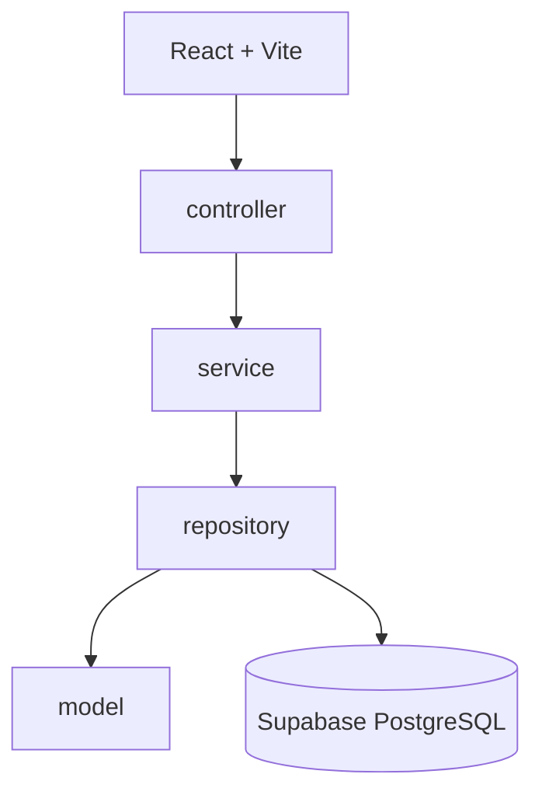

# Diagramas

Os fontes UML estão em `casos-de-uso.puml`, `diagrama-de-classes.puml` e `diagrama-de-pacotes.puml`. Abaixo, a mesma versão para leitura no GitHub.

```mermaid
flowchart LR
  Cliente((Cliente))
  Empresa((Agente empresa))
  Banco((Agente banco))
  subgraph Norte
    A[Autenticar]
    C[Manter cliente]
    P[Introduzir e consultar pedido]
    V[Avaliar pedido]
    R[Contrato de crédito]
  end
  Cliente --> A
  Cliente --> C
  Cliente --> P
  Empresa --> V
  Banco --> V
  Banco --> R
```

```mermaid
classDiagram
  Usuario "1" --> "0..1" Cliente
  Usuario "1" --> "0..1" Agente
  Cliente "1" *-- "0..3" Empregador
  Cliente "1" --> "*" Pedido
  Automovel "1" --> "*" Pedido
  Pedido "1" --> "0..1" ContratoCredito
  Agente "1" --> "*" ContratoCredito
```

```mermaid
flowchart TB
  react[React + Vite]
  controller[controller]
  service[service]
  repository[repository]
  model[model]
  db[(Supabase PostgreSQL)]
  react --> controller --> service --> repository --> model
  repository --> db
```
